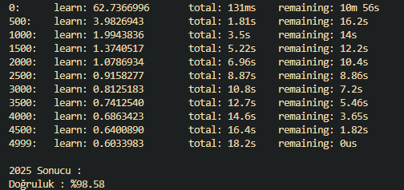

YKS 2026 Üniversite Puan Tahmin Modeli

Geçmiş yıllardaki üniversite yerleştirme verilerini kullanarak 2025 performansını test eden (2022 - 2024 verileri ile) ve 2026 puanlarını tahmin eden bir model yaptım.

## Projede Ne Yaptım?
- Öncelikle python da selenium kütüphanesi kullanarak Türkiyede ki tüm üniversitelerin bölümlerin son 4 yıl verilerini çektim.
- Bu verileri temizleyip düzenleyerek analiz edilebilir hale getirdim.
- Bu verilere raw_data klasöründen ulaşabilirsiniz. ( Siz de belki başka şeyler geliştirirsiniz işinize yarar :3 )

## Model Seçimi ( CatBoost )
Bu projede ana model olarak **CatBoostRegressor** kullandım

CatBoost'u seçme sebebim ise
-Kategorik verilerde çok başarılı olması
-Eksik verilere karşı dayanıklı olması
-Overfitting'e karşı diğer modellere göre daha dirençli olması (Sınav verilerini ezberleyebilir model çok riskli)

Bu veri setinde özellikle:
Bbölüm, üniversite, kontenjan gibi kategorik yapıların güçlü olması CatBoost’u daha mantıklı hale getirdi.

## Model Nasıl Öğreniyor?

Model şu sinyalleri kullanarak öğreniyor:

- Geçmiş yıl puanları
- Puan değişim trendi
- Kontenjan artış / azalış etkisi
- Bölümün genel ortalama seviyesi
- Sıralama / kontenjan ilişkisi
- Yıllara göre sınav zorluğu etkisi

## Eğitim Süreci

Modeli zamana göre böldüm:

- **2022–2024** → eğitim verisi  
- **2025** → test verisi (gerçek performans ölçümü)

Bu sayede modelin geleceği görmeden öğrenmesini sağladım.

## 2025 Test Sonucu

Model 2025 yılı üzerinde test edilerek doğruluk ölçümü yapıldı.

## 2026 Tahmini

Model 2025 verisini baz alarak:

- 2026 yılı için yeni feature set oluşturuyor
- Geçmiş trendleri kullanarak forward prediction yapıyor
- Hafif smoothing uygulanarak daha stabil sonuçlar üretiliyor

## Klasör Yapısı

- `data/` → işlenmiş veri seti  
- `raw_data/` → selenium ile çekilen ham veriler  
- `features_cache.parquet` → hızlı feature cache  
- `app.py` → model training + prediction  
- `universite_2026.csv` → final tahmin çıktısı  

## 📌 Not

Bu model kesin sonuç vermez, sadece geçmiş verilerdeki pattern’leri öğrenerek geleceğe yönelik tahmin üretir.